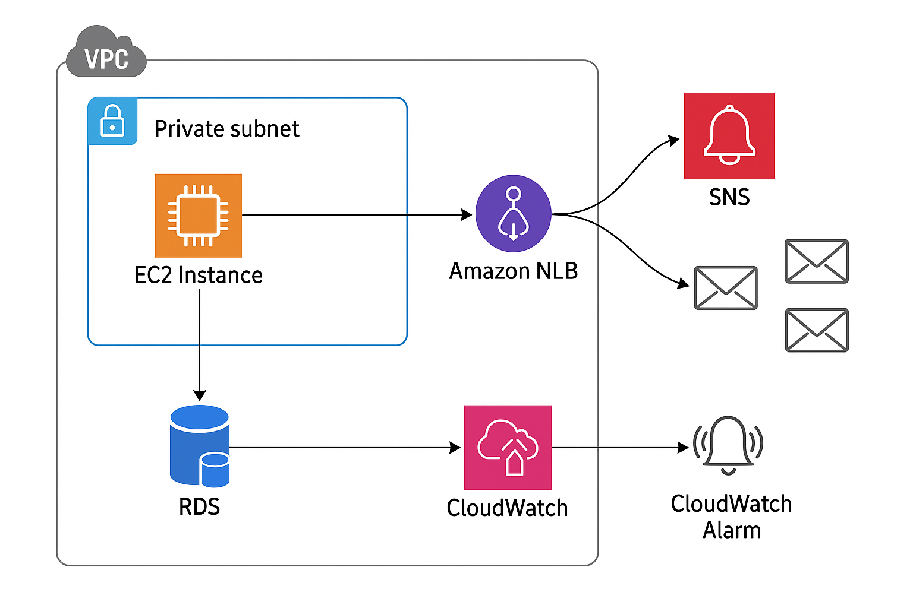

markdown

# Integrated AWS Monitoring Stack (Private Subnet / RDS Failover / NLB + EC2)

本リポジトリは、以下の要件をすべて満たす **AWS CDK (TypeScript)**
ベースの統合監視基盤を構築します。

-   ✅ **Private Subnet 専用構成**
-   ✅ **RDS フェイルオーバー検知特化**
-   ✅ **NLB + RDS + EC2 統合監視**
-   ✅ **ポートごとの個別 CloudWatch Alarm + SNS メール通知**
-   ✅ **CloudWatch ダッシュボード自動生成**
-   ✅ **SSM 管理対応（踏み台不要）**


------------------------------------------------------------------------


---

## アーキテクチャ



---


## 1. 全体構成概要

    [Private Subnet]
        |
        ├─ EC2 (監視ノード / SSM管理)
        |      └─ cron + bash ポート監視
        |              ↓
        |        CloudWatch Custom Metrics
        |              ↓
        |        Port別 CloudWatch Alarm
        |              ↓
        |          ポート別 SNS Topic
        |              ↓
        |            E-mail 通知
        |
        ├─ NLB (Internal)
        |      └─ Target Group -> EC2
        |              ↓
        |        UnhealthyHost Alarm
        |              ↓
        |             SNS 通知
        |
        └─ RDS (Multi-AZ)
               ├─ Writer / Reader
               ├─ ReplicaLag Alarm
               ├─ DatabaseConnections Alarm
               └─ Failover Event → SNS 通知

    [AWS API Access]
        └─ VPC Interface Endpoints
             - CloudWatch
             - Logs
             - SNS
             - SSM
             - EC2 Messages
             - STS
        └─ S3 Gateway Endpoint

------------------------------------------------------------------------

## 2. 機能一覧

  -----------------------------------------------------------------------
  機能                                内容
  ----------------------------------- -----------------------------------
  Private Subnet 専用                 監視 EC2 に Public IP
                                      を割り当てず、VPC
                                      エンドポイント経由で AWS API
                                      にアクセス

  複数ポート死活監視                  bash + /dev/tcp による TCP
                                      ポート監視

  カスタムメトリクス                  `Custom/PortCheck` namespace に送信

  ポート別アラーム                    Host + Port 単位で CloudWatch Alarm
                                      を作成

  ポート別 SNS 通知                   各ポートに専用 SNS Topic を作成

  RDS フェイルオーバー検知            RDS Event Subscription (failover)

  RDS メトリクス監視                  ReplicaLag / DatabaseConnections

  NLB 監視                            UnHealthyHostCount アラーム

  EC2 監視                            CPU 使用率アラーム

  統合ダッシュボード                  すべてのメトリクスを CloudWatch
                                      Dashboard に可視化

  SSM 管理                            踏み台不要で Session Manager
                                      による接続可能
  -----------------------------------------------------------------------

------------------------------------------------------------------------

## 3. 監視対象

### 3.1 ポート監視対象（例）

-   RDS Primary : 5432
-   RDS Reader : 5432
-   Web Server : 443
-   SSH : 22

これらは **UserData 内の配列で自由に拡張可能** です。

------------------------------------------------------------------------

## 4. ディレクトリ構造

    .
    ├─ bin/
    │   └─ app.ts
    ├─ lib/
    │   └─ integrated-monitor-stack.ts
    ├─ cdk.json
    ├─ package.json
    ├─ tsconfig.json
    └─ README.md  ← 本ファイル

------------------------------------------------------------------------

## 5. デプロイ方法

### 5.1 前提条件

-   Node.js 18.x 以上
-   AWS CLI 設定済み
-   AWS CDK v2 インストール済み

``` bash
npm install -g aws-cdk
```

------------------------------------------------------------------------

### 5.2 プロジェクト初期化

``` bash
npm install
cdk bootstrap
```

------------------------------------------------------------------------

### 5.3 デプロイ

``` bash
cdk deploy
```

------------------------------------------------------------------------

### 5.4 SNS メール承認（重要）

デプロイ後、以下の SNS トピックから **確認メールが届きます**。

-   各ポート用 SNS
-   RDS フェイルオーバー用 SNS
-   NLB 監視用 SNS
-   EC2 監視用 SNS

✅ **すべてのメールで「Confirm
subscription」を必ずクリックしてください。**\
未承認の場合、一切メール通知は届きません。

------------------------------------------------------------------------

## 6. CDK コード仕様

### 6.1 主要リソース一覧

  リソース                 用途
  ------------------------ ------------------------------------
  EC2                      ポート監視ジョブ実行
  IAM Role                 CloudWatch + SSM 送信権限
  VPC Endpoint             Private Subnet から AWS API へ接続
  SNS                      通知ハブ
  CloudWatch Alarm         異常検知
  CloudWatch Dashboard     可視化
  NLB                      EC2 の TCP 負荷分散
  RDS Event Subscription   フェイルオーバー検知

------------------------------------------------------------------------

### 6.2 カスタムメトリクス仕様

  項目         内容
  ------------ ---------------------
  Namespace    Custom/PortCheck
  MetricName   PortStatus
  Value        1 = 正常 / 0 = 異常
  Dimensions   Host, Port
  送信間隔     5分

------------------------------------------------------------------------

### 6.3 RDS フェイルオーバー検知

-   `CfnEventSubscription`
-   EventCategory: `failover`
-   SNS トピックへ即時通知

------------------------------------------------------------------------

### 6.4 NLB 監視

-   TargetGroup の `UnHealthyHostCount`
-   1以上で即アラート

------------------------------------------------------------------------

### 6.5 EC2 監視

  メトリクス       閾値
  ---------------- -------------------
  CPUUtilization   90%以上でアラート

------------------------------------------------------------------------

## 7. 注意点

-   Interface VPC Endpoint は **時間単位課金** が発生します。
-   CloudWatch ダッシュボードも課金対象です。
-   RDS Multi-AZ は一時的に ReplicaLag が発生することがあります。
-   フェイルオーバー検知は **イベント + メトリクス二重化検知**
    を推奨します。

------------------------------------------------------------------------

## 8. 今後の拡張例

-   Slack / Microsoft Teams 通知
-   SSM Parameter Store による監視対象自動ロード
-   AutoScaling Group 監視追加
-   Lambda ベースの軽量監視ノード化

------------------------------------------------------------------------

## 9. ライセンス

MIT License

------------------------------------------------------------------------

## 10. 作成者

-   AWS CDK / Cloud Infrastructure Automation
